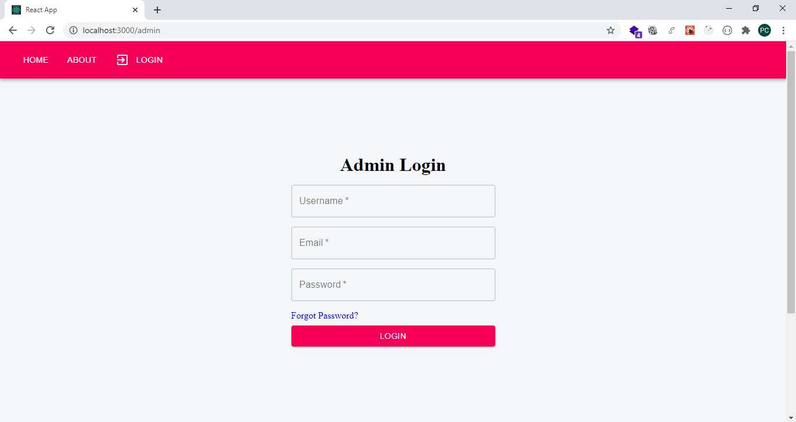
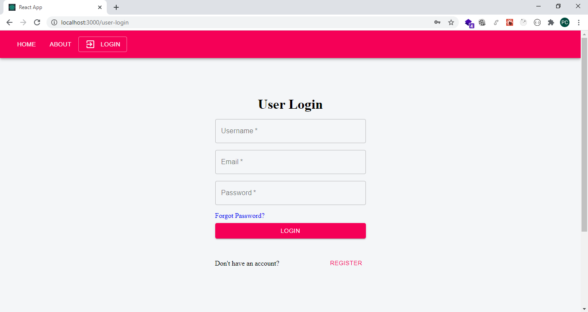
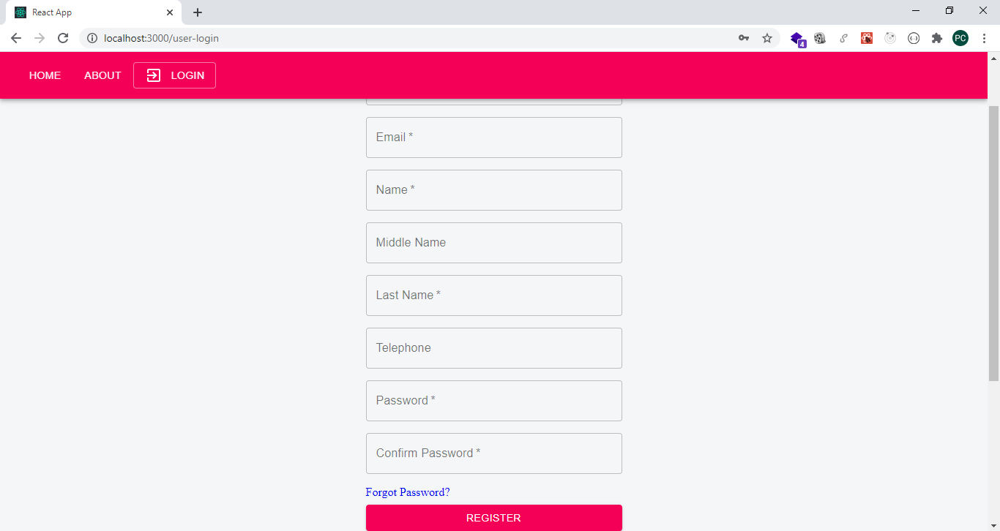

# DRY CLEANER SHOP

A Full-Stack Web App with a React.js Frontend (Materialize CSS), and Node.js Backend(MongoDB).

- **Backend:**
 - Express.js with MongoDB - Mongoose
 - Authorisation with JWT Tokens
 - Password Hashed
 - Add Images using multer and sharp libraries

- **Frontend:**
 - React with Material UI
 - axios has been used
 
 ** **
 
 **What is Achieved Up to Now?**
 - **Admin User Type(with full Authority)**
 - Admin has full authority, he can create/delete Category, Create/Update/Delete Service, Create/Update/Delete Customer, Create/Update Orders & Payments, Add Employee.
 - I am not sharing my Admin Credentials to protect my Category and Services, but you can do lots of things using Employee Credentials below.
 - **Employee User Type(Employee) (Limited Authority)**
 - This user type is very similar to Admin. Actually if you see  /models/Admin.js you will see that the only difference is "isEmployee" field.
 - But Employee  can not perform fundemental changes just like Add/Delete/Update Category & Services. 
 - He can add Customers, but he can NOT delete Customers. 
 - If an Employee creates a Customer using his panel, this created Customer has a default password "aPassword". Customer can login using this password and can change after Employee creates account.
 - All UI of Employee is same (at the moment) with Admin User. So when you try to Manipulate Category, Services you will face with an Alert with No Permission. Employee can see only his/her account on EmployeeList Page, however Admin Accounts will see all Accounts. 
 
 - **Employee Login Credentials for you to see this Demo Live**
  
    - **Username: testadmin**
    - **Email: testemployee@test.com**
    - **Password: 12345678**
    
  - **Customer User Type (User Model /models/User.js)**  
  
  - Customer User Type can track their payments, Orders, but can not manipulate them. They can update their password, update address, name, etc. 
    
- **Customer Login Credentials for you to see this Demo Live (You can also register if you wish)**

    - **Username: jdoe**
    - **Email: jdoe@gmail.com**
    - **Password: 123456**
    
    
- **Public User Type**   
  - Can see Categories, Services and Prices. Can also see Contact Information by Footer.
  
    
  [**It has been deployed to Heroku, so you can see!**](https://komnata-dry-cleaner-shop.herokuapp.com/)
  
  **[Client Login Page Link](https://komnata-dry-cleaner-shop.herokuapp.com/user-login)**  
  **[Admin Login Page](https://komnata-dry-cleaner-shop.herokuapp.com/admin)**  
    
    
** **

## Some Screenshots

### ---------Public---------

- **Public Home Page**

- **Public Admin Login Page**

- **Public Client Login Page & Register Page**

** **

### -----Admin User-----

- A Dashboard URL with 3 Tabs ( Customers, Orders, Services )

** **

- **Customers Tab**

** **

- **Orders Tab with Orders & Payments Select Options**

  - **Orders Option**

    
  

  
  - **Payments Option**
  
  
  
  

  

  
** **

- **Services Tab**

** **

- **Add Payments**

** **

- **Add Service**

** **

- **Customer Details**

** **

- **Products Page**

** **

### -----User (Customer)-----

** **

- **Cart**

Although you can add items to Cart in also Public Mode, I  will demonstrate Cart in User Mode.

Below are Images of Cart with Items and Empty Cart

** **

- **Orders**

** **

## ---------------Backend---------------

- Node.js with Mongoose,
- A Backend with 2 different bcrypt.js Secrets - 1 for Users, 1 for Admins,
- Multer & Sharp Libraries for Files
- jwt authentication
- password hash by bcryptjs.js
