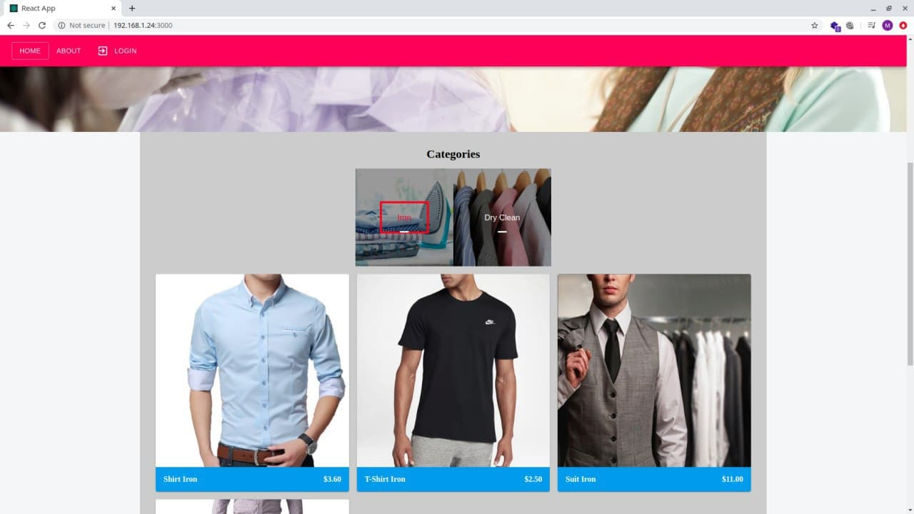

# DRY CLEANER SHOP

A Full-Stack Web App with a React.js Frontend (Materialize CSS), and Node.js Backend(MongoDB).

- **Backend:**
 - Express.js with MongoDB - Mongoose
 - Authorisation with JWT Tokens
 - Password Hashed
 - Add Images using multer and sharp libraries

- **Frontend:**
 - React with Material UI
 - axios has been used
 
 ** **
 
 **What has been Achieved Up to Now?**
 - **Admin User Type(with full Authority)**
 - Admin has full authority, he can create/delete Category, Create/Update/Delete Service, Create/Update/Delete Customer, Create/Update Orders & Payments, Add Employee.
 - I am not sharing my Admin Credentials to protect my Category and Services, but you can do lots of things using Employee Credentials below.
 - **Employee User Type(Employee) (Limited Authority)**
 - This user type is very similar to Admin. Actually if you see  /models/Admin.js you will see that the only difference is "isEmployee" field.
 - But Employee  can not perform fundemental changes just like Add/Delete/Update Category & Services. 
 - He can add Customers, but he can NOT delete Customers. 
 - If an Employee creates a Customer using his panel, this created Customer has a default password "aPassword". Customer can login using this password and can change after Employee creates account.
 - All UI of Employee is same (at the moment) with Admin User. So when you try to Manipulate Category, Services you will face with an Alert with No Permission. Employee can see only his/her account on EmployeeList Page, however Admin Accounts will see all Accounts. 
 
 - **Employee Login Credentials for you to see this Demo Live**
  
    - **Username: testadmin**
    - **Email: testemployee@test.com**
    - **Password: 12345678**
    
  - **Customer User Type (User Model /models/User.js)**  
  
  - Customer User Type can track their payments, Orders, but can not manipulate them. They can update their password, update address, name, etc. 
    
- **Customer Login Credentials for you to see this Demo Live (You can also register if you wish)**

    - **Username: jdoe**
    - **Email: jdoe@gmail.com**
    - **Password: 123456**
    
    
- **Public User Type**   
  - Can see Categories, Services and Prices. Can also see Contact Information by Footer.
  
    
  [**It has been deployed to Heroku, so you can see!**](https://komnata-dry-cleaner-shop.herokuapp.com/)
  
  **[Client Login Page Link](https://komnata-dry-cleaner-shop.herokuapp.com/user-login)**  
  **[Admin & Employee Login Page](https://komnata-dry-cleaner-shop.herokuapp.com/admin)**  
    
    
** **

## Some Screenshots


### ---------Public---------

- **Public Home Page**



- **Public Admin Login Page**


- **Public Client Login Page & Register Page**


** **


### ---------Admin And Employee User---------

- **Dashboard Page**


- **Customers Page**


- **Add Customer Page**                                                                               


- **Orders Page**


- **Add / Edit Order Page**                                                                               


- **Payments Page**


- **Categories Page**


- **Categories Page Delete Confirmation**                                                                               


- **Add Category Page**                                                                               


- **Services Page**


- **Update Service Page**                                                                               


- **Employee List Page**


- **Add Employee Page**                                                                               


** **


### ---------Customer User---------

- **Main Page (To See Activities)**


- **Order Details Page (To See Single Order Details)**


- **Account Information Page**


- **Change Password Page**


** **


## TO USE THIS REPO
- **Create /config/default.json for Development Purpose with Following Code** 
- **Create /config/production.json for Production Purpose with Following Code** 
```

{
  "mongoURI": "mongodb+srv://_YOUR_MONGO_URI",  
  "jwtSecret":      "YOUR JWT SECRET FOR CUSTOMERS",
  "jwtSecretAdmin": "wYOUR JWT SECRET FOR ADMINS AND EMPLOYEE"
}

```

- **NOTE**
 - At the moment, if there is no category added, HomePage will face with an error, since when loading, by default Category[0] Items will be shown. Thus, if there is no category, it causes  an error. 
 
 
 ** **
 
 
 ## TODO LIST
 
 -  Add Stripe Payment
 - Update Order Structure to handle Options for Refunds, 
 - Return Dresses if customer satisfaction is not enough, 
 - cookie authentication, 
 - Email Option
 - Add SCSS
 - Add SSR using Next.js
 
 
